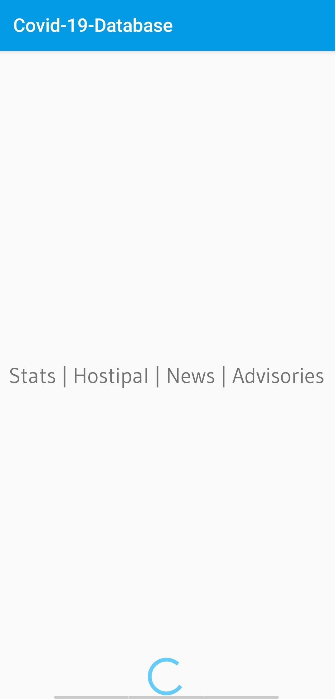
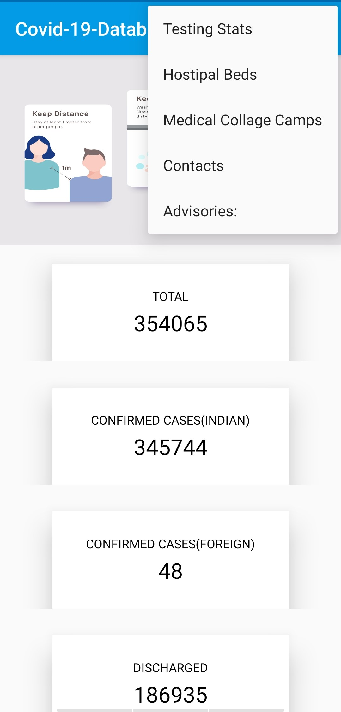

# Covid-19-Database
Stats | Hospital | News | Advisories
 

 
<h1>About Application</h1>
Native Android Application which provides stats, hospital details, news, advisories given by GOVT in form of pdf and links regarding COVID19 pandemics.

 
<h1>Screenshots</h1>
         

 
<h1>Stats</h1>
<b>Realtime stats provided to users</b>
 
    
 
<h1>Details</h1>
<b>Emergency Detail</b>
 
   

 
<h1>News</h1>

 

 
<h3>Developed by Jaspreet Singh</h3>
Gmail =jaspreetsidhu3may@gmail.com
linkedin =https://www.linkedin.com/in/jaspreetsidhu13/

<h3>More about COVID19</h3>
WHO =https://www.who.int/emergencies/diseases/novel-coronavirus-2019
 
India =https://www.mygov.in/covid-19
